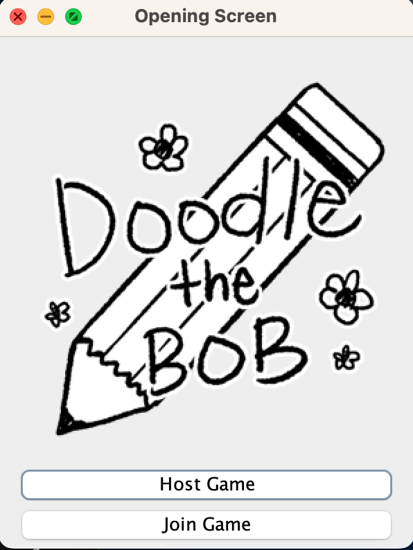

# Pictionary Project

This is a pair project mimicking the game **Pictionary**, made by Daniel Del Rio and Riana Lim for CS 21B (2018). This makes use of concepts related to networking, threads, and timers.

Instructions to run the program:

```
javac *.java
java OpeningScreen
```

You'll need to have at least five instances of `OpeningScreen`: one GameServer and four Players (at least two Players each on two teams). Whoever runs the GameServer has to click "Host Game" and accept connections, before stopping the acceptance of connections once the four players join the game. All players and GameServer have to be on the same network.


